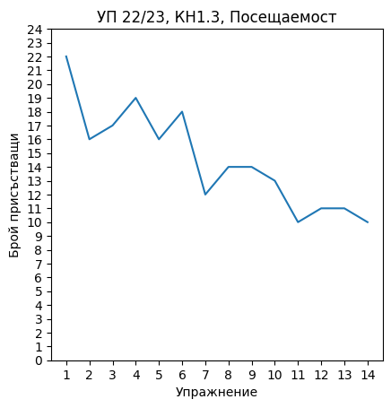

# Седмица 15

## Статистика за семестъра

### Общо решени задачи - **111**

<br/>



<br/>

Студентът, посетил всяко едно упражнение - **Михаил Цветков** 
## Задачи за седмица 15

### Зад. 1 - [решение](solutions/task01.cpp)

Да се напише булева функция, която приема матрица NxN (N <= 100), и която връща true, ако матрицата е симетрична. Пример за симетрична матрица:

```
0 5 9 3
5 4 7 1
9 7 6 2
3 1 2 4
```


### Зад. 2 - [решение](solutions/task02.cpp)

Нека имаме масив от реални числа `double arr[50]`, реално число `double expected` и `int size` - размер на масива (`size` <= 50). Напишете функция, която добавя към масива толкова нули в края, така че средното аритметично на елементите на масива (след добавянето на нулите) да е по-малко или равно на `expected`, и така че, ако се добавят по-малко нули, средното аритметично да е по-голямо от `expected`. Пример:
```
вход: arr = {1, 2, 3}, expected = 1
изход: arr = {1, 2, 3, 0, 0, 0}
```

### Зад. 3 - [решение](solutions/task03.cpp)

Да се напише рекурсивна функция, която намира броя на всички числа от интервала [a,b], цифрите на които образуват монотонно намаляваща редица(помощната функция, която ще проверява дали цифрите на дадено число образуват монотонно намаляваща редица, също да е рекурсивна).

### Зад. 4 - [решение](solutions/task04.cpp)

Да се напише програма, която прочита текстов файл в следния формат

```
# Задачи за седмица 15

### Зад. 1

...
...
...

### Зад. 2

...
...
...
```

и която връща броя на задачите в този файл. Примете, че всеки ред във файла е до 1024 символа.

### Зад. 5 - [решение](solutions/task05.cpp)

Нека е дадена матрица NxN (N <= 100), която представя познанствата между хората на дадено парти. Пример:
```
1 0 1 1
0 1 1 0
1 1 1 0
0 0 0 1

Първи ред от матрицата - Човек 0 освен себе си познава и човек 2 и човек 3

Втори ред от матрицата - Човек 1 освен себе си познава и човек 2

Трети ред от матрицата - Човек 2 освен себе си познава и човек 0 и човек 1

Четвърти ред от матрицата - Човек 3 освен себе си не познава никого друг
``` 

Забележете, че познанството не е симетрично. Напишете функция, която приема такава матрица и връща(ако съществува) човека, който всеки познава.

### Зад. 6 - [решение](solutions/task06.cpp)

Напишете функция, която приема символен низ и връща указател към нов символен низ, който съдържа всички елементи на оригиналния низ, но всички съседни повторения на символ са премахнати. Пример:

```
вход:  AABBBCDDD
изход: ABCD
```

### Зад. 7 - [решение](solutions/task07.cpp)

Нека е дадена структура `Student`, която представя един студент. Всеки студент има име и дата на раждане(ден, месец и година). Напишете функция, която приема масив от студенти и ден от годината и която връща студента, който най-скоро има рожден ден след този ден от годината. Пример:

```
Студент 1: Митко, 10.01.2003
Студент 2: Ади, 30.04.2003
Студент 3: Петко, 08.05.2003
Студент 4: Вики, 19.05.2003

Ден: 121 (01.05)

Резултат: Студент 3
```

### Зад. 8 - [решение](solutions/task08.cpp)

Напишете рекурсивна функция, която отпечатва декодиран символен низ. Пример:

```
вход: 3а2bcd2a
изход: aaabbcdaa
```